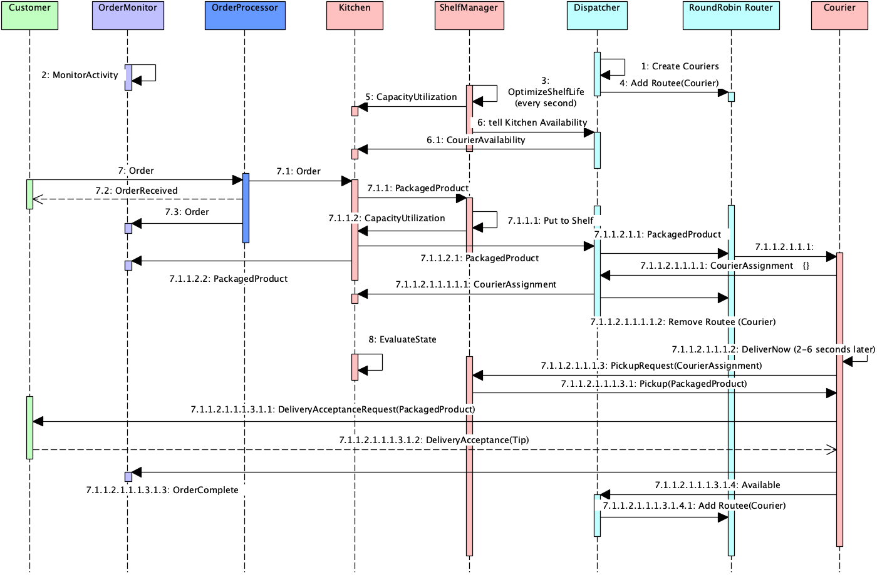

# Reactive 

Reactive is a real-time system that emulates the full-fillment of delivery orders for a kitchen.

# Components
# Component Overview
1. Coordinator is the main controller, its main function is to initialize the system and monitor health. All other actors are supervised by Controller. Currently it is working with DefaultSupervision Strategy. 
1. Customer. Simulates customers sending orders. Currently, reads from a file and sends as a stream. It is possible to turn this into an ongoing stream.
1. OrderProcessor routes orders to Kitchens. 
1. OrderMonitor is the only persistent actor in the System. It maintains of all LifeCycle events for all orders. Eventually it can act as 'Service Bus' which the other actors can subscribe to life-cycle events. 
1. Kitchen prepares the orders and hands them off to ShelfManager for Storage. It also notifies Dispatcher expecting an assigned Courier for Delivery.
1. Courier delivers the orders routed by Dispatcher. Courier notifies its state to Dispatcher to ensure that Courier does not get assigned for additional orders while on delivery
1. ShelfManager manages Storage till packaged products get delivered to customers by Couriers. It maintains a cache of active courier assignments to packagedProducts.

## Main Flows
### Successful Delivery
* Customer sends Orders to OrderProcessor
* Orders are sent to Kitchen.
* Kitchen prepares a "packaged product" for the order and passes it to ShelfManager for storage till pickup. 
  * Kitchen simultaneously notifies Dispatcher for upcoming delivery assignment
* Dispatcher assigns a Courier for incoming packaged product delivery request and routes it to one of its Couriers
  for pickup and delivery, using RoundRobin logic among its available Couriers
* Courier upon receiving request for delivery
   * Creates a CourierAssignment and sends it to ShelfManager as well as Dispatcher
* Courier after 2-6 seconds sends a PickupRequest to ShelfManager. 
  * ShelfManager responds with Pickup
* Courier sends DeliveryAcceptanceRequest to Customer, effectively simulating signature. 
  * Customer responds with DeliveryAcceptance 
* All order life cycle events (Order, PackagedProduct, DeliveryComplete, DiscardOrder) are sent to OrderProcessor which keeps a durable history, and and a cache for all active orders

### Discarded Order
* ShelfManager calls ShelfLifeOptimization logic either periodically (every 1 second) or as products are added to the shelf
    * Any expired products are notified to Courier and Customer as DiscardOrder. They are also published to OrderMonitor for life-cycle tracking. 
* Courier may get back a DiscardOrder message as response to PickupRequest if the product has expired just recently
* Courier declines any orders while on delivery. It becomes available by sending Available message to Dispatcher only after delivery is complete or order is discarded.     

# Notes for Future Architectural Enhancements 
1. Enhance BackPressure handling logic between major components. ie. Between OrderProcessor and Kitchen. 
1. Coordinator to actively manage failed components, currently it is simply logging about unhealth components. 
1. Circuit Breakers between major components. ie. OrderProcessor Kitchen.  OrderProcesor CourierDispatcher etc.
1. OrderMonitor may publish incoming events to subscribers. It will cleanup some of the code.
1. Get ready to run on cluster. Please note that the code as written can be easily run on a multi-node cluster due to Akka's location transparency features, with very little code change if any.

## About AKKA Persistent Actors:
1.   Stateful Actors preserve state. They are able to replay messages that were sent to them during crash
1.   They also can create 'Snapshot's of their states so recovery can happen instantly. Not implemented yet. TODO
1.   Akka supports various persistence options, like Relational, Cassandra etc. I chose LevelDb for simplicity
1.   It is also possible to do a Persistent Query on PersistentActors to query state. Not implemented yet. TODO

# ShelfLife Optimization algorithm
 
### Objective
 Storage Product Life Cycle Optimization Algorithm has the following objectives:
 - Minimize the number of discarded products due to expiration
 - Minimize the time to discard an order if an order has to be discarded due to insufficient shelf capacity
 - Maximize the shelfLife 'value' of the products delivered to customers

### Background
1. Storage can be configured to work with multiple shelves each of which provide different Capacity, decayRateModifier
1. Each Shelve can declare what "temperatures" it supports.
1. Overflow shelf can accommodate products of all temperatures but with higher decayRateModifier (currently 2)
1. 'Hot', 'Frozen', 'Cold' shelves only accept products that matches the corresponding temperatures.
1. Each order is defined by shelfLife and decayRate.
1. Couriers are recurited in batches as needed by Dispatcher upto a maximum number of couriers controlled by config.
 
### Constraints
1. Couriers are assigned to a single PackagedProduct and they are supposed to pick up the product they are assigned
1. Couriers are expected to come between 2 to 6 seconds after their assignment
1. Value of a product on shelf is calculated as: 
   1. (shelfLife - orderAge - decayRate * orderAge * shelfDecayModifier) / shelfLife
1. Storage is to have single shelf for each temperature supported("hot", "cold","frozen") each with limited capacity, default 10
1. Maximum number of couriers to be recruited is fixed, and controllable by config.

### Approach
 1. Shelves keep the products in a sorted set with increasing order of "value"
 1. All new products received are put into Overflow shelf first.
 1. Shelf optimization is done 
     1. when new products are added to Storage 
     1. periodically on schedule (currently every second, controllably by config)
 1. Whenever a public API of storage is accessed, refresh the PackagedProduct definitions, and take a snapshot of the Storage, effectively making a copy. 
 1. PackagedProduct maintains 'remainingLife' and 'lastUpdate' and given the decayRateModifer constant of the shelf they are on, can calculate current value
 1. PackagedProduct also can calculate expected expirationInMilliseconds and expectedDeliveryWindow
   
### Steps
 1. Discard all expired products on all shelves
 1. Move products in overflow shelf to corresponding 'temperature sensitive' (aka target) shelves with lower decayRate modifier while there is capacity on those shelves
 Note: Current implementation assumes single "target" shelf for each temperature.
 1. If overflow shelf is full
    1. Expire products that will not be be deliverable within the  expected pickup window (using the 2 second minimum delay)
    1. Replace products that can benefit with increased shelf life if swapped by a product in target shelf, if the swap will not put the other in to critical zone. 
       1. CriticalZone is controlled by a constant currently with default=2 seconds
 1. If the overflow shelf is still full
   1. While overflow is over capacity: discard the product with the newest order creation timestamp. This is so that we minimize the time the customer gets feedback and we reduce waste if the product is already on the way to delivery
 
# Considerations for Improvement
1. Swapping products between overflow and other shelves can be started before waiting for overflow shelf to be full to further optimize shelf life 
1. If CourierAssignments can be adjusted by ShelfManager based on what product is at risk of expiration, it would improve customer satisfaction
1. Further improvement after relaxing courier assignments might be that: we can learn from past orders as to what the likelyhood of a particular 'temperature sensitive' shelf to open up might be, and run a short simulation into the future to decide which product to discard.  

# Getting Started
1. CloudKitchens actor is the main controller that starts the entire ActorSystem.
## Run main Simulation
1. Find Reactive Application under src/main/scala/reactive/CloudKitchens file. It is a runnable Application. Right mouse click on the green triangle in Intellij and run it.
1. Currently it sends two messages to CloudKitchens actor that it starts
   1. demo ! Initialize
   1. demo ! RunSimulation(numberOfOrdersPerSecond = 2, shelfLifeMultiplier = 1f, limit = 200, resetDB = false)
      1. You can modify these simulation settings:
         1. numberOfOrdersPersecond controls the throttle setting of stream from Customer to OrderProcessor
         1. shelfMultiplier: if you want to experiment system behavior for faster expiring products set this to a number between 0 and 1 as multiplier
         1. limit: controls number of messages that will be processed from orders.json file.
         1. resetDB: If you want to reset the database state (in OrderMonitor) you can turn this on, or simply delete the files under /target/cloudKitchens/journal and /target/cloudKitchens/snapshots
      1. Alternative setting: 
        demo ! RunSimulation(numberOfOrdersPerSecond = 10, shelfLifeMultiplier = 0.1f, limit = 200, resetDB = false)   
1. After 5 seconds of no activity, program will automatically shutdown by OrderMonitor and OrderLifeCycle Report will be printed to the log.
## Note on OrderMonitor
1. OrderMonitor is a persistent actor. If you run the simulation multiple times, Customer gets the last orderId from previous runs and automatically updates
the orderId of the Orders read from file before it sends it to OrderProcessor. 

## Configuration: 
1. Configuration of the application is located under src/main/resources/application.conf
1. I suggest resetting the OrderMonitor persistent state if you making config changes to get more accurate reporting on new settings.
1. You can change the log level by modifying:   # loglevel = "INFO" to akka.loglevel = "DEBUG" and vica versa.
   1. Most of the chatty conversations between components, like heartbeats, and status and availability updates etc are only viewable in DEBUG mode.
1. You can also change configurations for ShelfManager and Dispatcher to observe system behavior under different settings. For example:
   1. Dispatcher:    dispatcher{
              ...
              max-number-of-couriers = 200  # Adjust this based on expected order throughput. 
              courier {
                  delivery-time-window-millis = 4000
                  earliest-delivery-after-order-received-millis = 2000
              }
          }
   1. ShefManager reporting frequency can be adjusted with these:
       shelfManager {
           ...
           overflow-utilization-safety-threshold = 0.9   
           overflow-utilization-reporting-threshold = 0.5  # Lower this if you want more frequent updates on the log
           ...
       }
   1. Shelf settings can also be adjusted as needed:
           shelf {
               ...
               hot-shelf-capacity = 10
               hot-shelf-decay-modifier = 1
               ...
               overflow-shelf-decay-modifier = 2
           }
      
## Run Tests
1. Unit and Integration tests though limited are provided under src/test/scala/ folders. Right click and run any test or an entire folder.

## Contact Me If you have questions running it
Kagan 650 438 0401  kagan@brane.com

